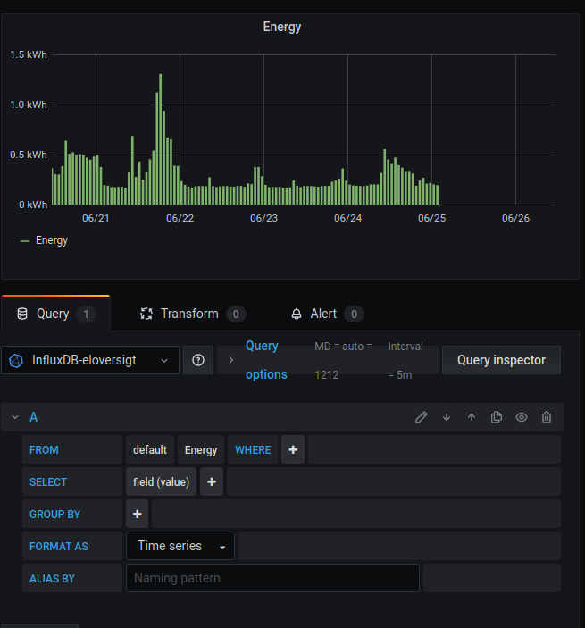

# Home Assistant Community Add-on: Example

## config
```
    "db_ip": "192.168.1.10", # database ip (or hostname)
    "db_name": "eloversigt", # database name (will create if it doesn't exsist)
    "db_port": 8086, # port (http only, create a issue if ssl is needed)
    "db_user": "", # username for database keep blank is no user
    "db_pass": "", # password for database keep blank is no user
    "sensorPrefix": "sensor.eloverblik_energy_", # the start of the name of the sensor to get values from (should not be nesseary to change)
    "webhookUrl": "", # set to url to post a json object when done running.
    "Timezone": "Europe/Copenhagen" # yeah i don't know why this would ever be anything else than Copenhagen
```
## using

the way i use this:

* Optional: Import old data using the bulkloader before you set this up.
* have a template sensor with the meter date from one of the sensors.
* a automation trigger when the meter date sensor changes and starts this add on.
* a automation listens for webhooks and notifies me when the script is done running.
* i use Grafana to create a graph and insert show it in lovelace using a iframe.

### Example Home-assistant config

#### Sensor
```
platform: template
sensors:
  metering_date:
    friendly_name: "Metering Date"
    unit_of_measurement: ''
    value_template: "{{ state_attr('sensor.eloverblik_energy_total', 'Metering date') }}"
    entity_id: sensor.eloverblik_energy_total
```
#### Automations
```
alias: "energy updates"
initial_state: 'on'
trigger:
  - entity_id: sensor.metering_date
    platform: state
action:
  - service: hassio.addon_start
    data:
      addon: "db328613_eloverblik_helper"
```

```
alias: "el overblik notifications"
trigger:
    platform: webhook
    webhook_id: eloverblik_webhook_for_notify
action:
  - service: notify.matrix_notify
    data_template:
      message: |
        El Overblik ran at {{trigger.json.time}} for Database: {{trigger.json.options.db_name}}@{{trigger.json.options.db_ip}}:
        {{trigger.json.message}}
```

### Grafana



```
SELECT "value" FROM "Energy" WHERE $timeFilter
```

#### Lovelace card

```
- type: iframe
  url: >-
    http://{grafana address}:{port}/d-solo/9wvMka8Wk/test?orgId=1&theme=light&panelId=4
  aspect_ratio: 60%
```

## Bulk loader
OBS: this tool should only be used on new series, it doesn't check if there is already data in the series, so use series that doesn't exist yet.

Make sure the dependencies are installed

```
pip3 install --trusted-host pypi.python.org -r requirements.txt
```

Get an export from [el overblik](https://eloverblik.dk) (make sure to export the amount used each hour)

Place an export in the same folder as the bulk loader script and fill the Local.json file with the relevant options (use the same as in home assistant supervisor)

Run the bulk loader

```
python3 bulkLoader.py
```

## Support

Got questions?

then please open an issue on [github](https://github.com/HBDK/ElOverBlik-helper)

## Authors & contributors

This add on is based on the example repository by [Franck Nijhof](https://github.com/frenck).

## License

MIT License

Permission is hereby granted, free of charge, to any person obtaining a copy
of this software and associated documentation files (the "Software"), to deal
in the Software without restriction, including without limitation the rights
to use, copy, modify, merge, publish, distribute, sublicense, and/or sell
copies of the Software, and to permit persons to whom the Software is
furnished to do so, subject to the following conditions:

The above copyright notice and this permission notice shall be included in all
copies or substantial portions of the Software.

THE SOFTWARE IS PROVIDED "AS IS", WITHOUT WARRANTY OF ANY KIND, EXPRESS OR
IMPLIED, INCLUDING BUT NOT LIMITED TO THE WARRANTIES OF MERCHANTABILITY,
FITNESS FOR A PARTICULAR PURPOSE AND NONINFRINGEMENT. IN NO EVENT SHALL THE
AUTHORS OR COPYRIGHT HOLDERS BE LIABLE FOR ANY CLAIM, DAMAGES OR OTHER
LIABILITY, WHETHER IN AN ACTION OF CONTRACT, TORT OR OTHERWISE, ARISING FROM,
OUT OF OR IN CONNECTION WITH THE SOFTWARE OR THE USE OR OTHER DEALINGS IN THE
SOFTWARE.
